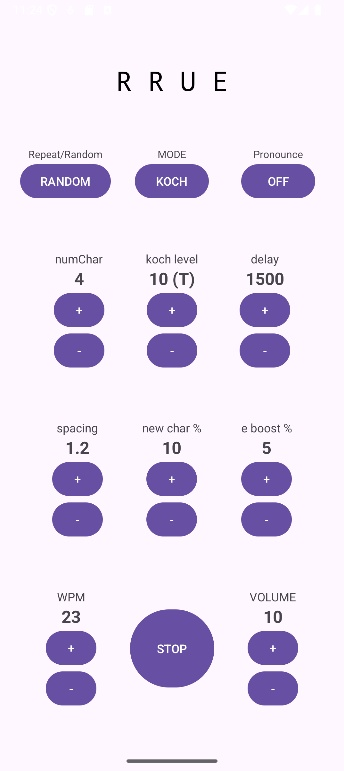

# Morse Listening Android Application

## Overview
This is an Android application designed for practicing Morse code listening. It supports alphabets, numbers, and symbols, offering highly customizable playback settings to suit your training level.

(

## Key Features
* **Various Modes**: Supports Repeat, Random, and Word-based playback.
* **Customizable Content**:
    * **Koch Method**: Levels 1 to 41.
    * **Word Mode**: Reads character strings from `word.txt`.
* **Audio Customization**: 
    * Adjust WPM (15–30), Spacing, and Volume.
    * Optional character pronunciation (voice) with adjustable delay.

##Download APK here (https://github.com/n-ky01/morseListening/releases)

## Settings & Parameters
You can customize your practice session with the following parameters:

| Parameter | Range / Options | Description |
| :--- | :--- | :--- |
| **Playback Mode** | Repeat / Random | Choose how codes are cycled. |
| **Training Mode** | KOCH / RANDOM / WORD | Select training methodology. |
| **Voice Guidance** | ON / OFF | Toggle character pronunciation. |
| **Koch Level** | 1 to 41 | Includes spaces as characters. |
| **WPM** | 15 to 30 | Words Per Minute. |
| **Spacing** | 1.0 to 5.0 | Relative to 3-dot length. |
| **Voice Delay** | 500 to 3000ms | Delay between Morse and voice output. |

**Note on WORD Mode**
* **Default: Uses 3 built-in words.**
* **Custom: Place your own word.txt in the directory below to override the default list. /Android/data/com.example.morselistening/files/word.txt**
* **Connect your device to a PC to access this directory.**

## Build Environment
* **Android Studio**: Ladybug | 2024.2.1 (or Otter 2025.2.1)
* **JDK**: 21 (Runtime version 21.0.8)
* **Target** SDK36

## License
This project is licensed under the [MIT License](https://opensource.org/license/mit).

--------------------
# モールス聞き取り Android アプリケーション

## 概要
モールス信号の聞き取りを練習するためのAndroidアプリです。アルファベット、数字、記号をサポートし、聞き取りレベルに合わせてカスタマイズ可能な再生設定を提供します。

## 主な機能
* **モード**: リピート、ランダム、およびワードベースの再生をサポートします。
* **カスタマイズ**:
    * **コッホ法**: レベル 1 ～ 41。 
    * **Word モード**: `word.txt` から文字列を読み取ります。
* **再生設定**:
    * WPM (15 ～ 30)、間隔、音量を調整します。 
    * 遅延を調整可能な音声発音。

##APKのダウンロードはこちら　(https://github.com/n-ky01/morseListening/releases)

## 設定とパラメータ
次のパラメータを使用して練習セッションをカスタマイズできます。

|パラメータ |範囲/オプション |説明 |
| :--- | :--- | :--- |
| **再生モード** |リピート/ランダム
| **トレーニングモード** |koch / ランダム / word
| **音声** |on/off
| **kochレベル** | 1 ～ 41 |文字としてスペースが含まれます。
| **WPM** | 15～30
| **spacing** | 1.0 ～ 5.0
| **音声遅延** | 500～3000msec |モールス信号と音声出力の間の遅延。 |

**WORDモードについてのご注意**
* デフォルト: 3 つの組み込み単語を使用します。
* カスタム: 独自の word.txt を以下のディレクトリに配置して、デフォルトのリストを上書きします。 /Android/data/com.example.morselistening/files/word.txt
* このディレクトリにアクセスするには、デバイスをUSBケーブルで PC に接続してください。

## ビルド環境
* **Android Studio**: Ladybug | 2024.2.1 (or Otter 2025.2.1)
* **JDK**: 21 (Runtime version 21.0.8)
* **Target** SDK36

## ライセンス
このプロジェクトは、[MIT ライセンス](https://opensource.org/license/mit) に基づいてライセンスされています。
